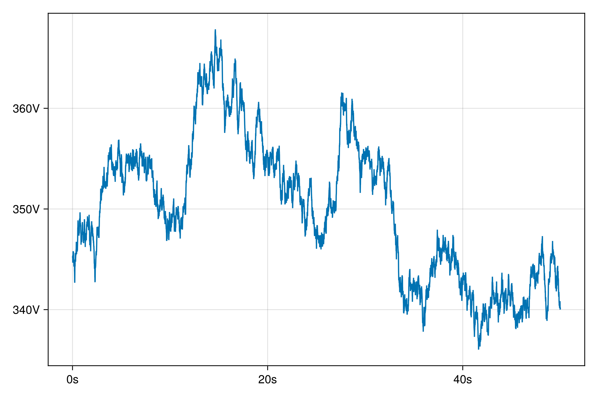

# TimeseriesTools 🕰️🛠️

[](https://brendanjohnharris.github.io/TimeseriesTools.jl/stable/)
[](https://brendanjohnharris.github.io/TimeseriesTools.jl/dev/)
[](https://github.com/brendanjohnharris/TimeseriesTools.jl/actions/workflows/CI.yml?query=branch%3Amain)
[](https://codecov.io/gh/brendanjohnharris/TimeseriesTools.jl)


TimeseriesTools.jl is a package for analyzing and visualizing time-series data in Julia. It provides a set of functions for preprocessing, analyzing, and plotting time series data, making your life better and your data look great, in that order.

## Features

- 📈 Practical utilities for working with time series
- 📊 Spectral analysis and visualization
- 🌈 Beautiful plotting using [Makie](https://github.com/MakieOrg/Makie.jl)

## Installation

To install TimeseriesTools.jl, simply run the following command in your Julia REPL:

```julia
] add TimeseriesTools
```

## Usage

Here's a quick example to get you started:

```julia
using TimeseriesTools, CairoMakie, TimeseriesTools.FFTW, Unitful

# Generate some quick brown noise
t = 0.005:0.005:1e5
x = colorednoise(t, u"s")*u"V" # ::AbstractTimeSeries
plot(x[1:10000])
S = powerspectrum(x, 0.001)
p = plot(S)
```




Note that an instance of the most basic type of this package, the `AbstractTimeSeries`, can be generated with:
```julia
t = 0:0.01:1
x = sin.(t)
TimeSeries(t, x)
```
Please see the documentation for further functionality.

## Acknowledgements 🙏

TimeseriesTools.jl builds upon the excellent [DimensionalData.jl](https://github.com/rafaqz/DimensionalData.jl) package for handling dimensions and indexing in time-series data.

_Don't blame me for this readme, blame gpt-4 🤖_

Happy analyzing! 🚀